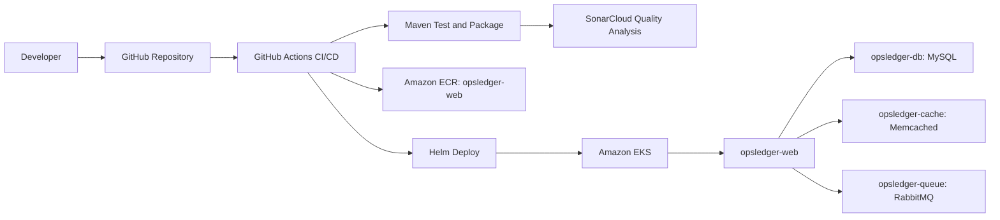

# OpsLedger Application Architecture

## Request Flow

Users access OpsLedger through the ingress and web service. The Java application stores account data in MySQL, uses Memcached for repeated account lookups, and sends demo approval events through RabbitMQ.

## Deployment Flow

GitHub Actions runs Maven tests, Checkstyle, and SonarCloud analysis when triggered manually. The publish path is gated behind a manual `publish` input so the public repository can be pushed safely before deployment credentials are configured. When enabled, the workflow builds the Docker image, pushes it to ECR, creates an EKS image pull secret, and deploys the Helm chart as the `opsledger-stack` release.

## Kubernetes Components

- Deployment and service for the web application.
- Deployment and service for MySQL.
- Deployment and service for Memcached.
- Deployment and service for RabbitMQ.
- Ingress for external access.
